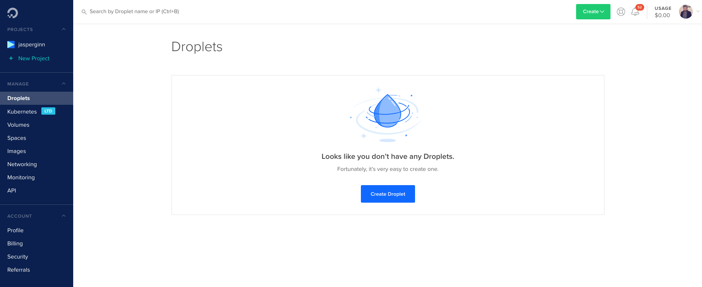
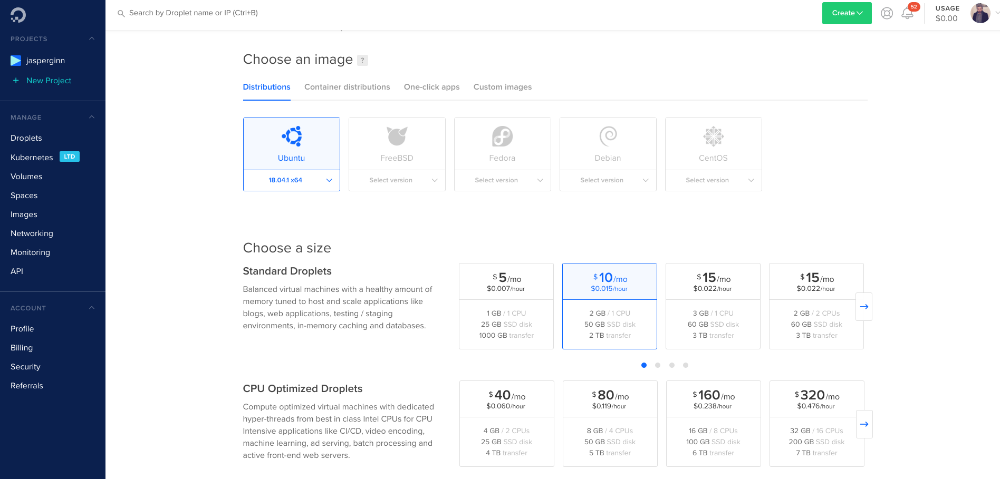
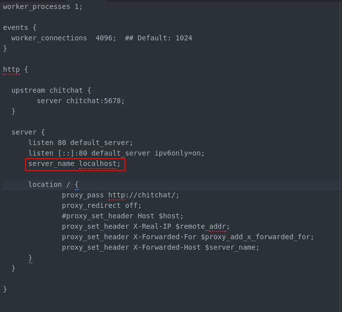

# Configuring and hosting ChitChat

In this tutorial, we show how you can configure and host ChitChat using [DigitalOcean](https://www.digitalocean.com/) in under 15 minutes.

1. Sign up for a DO account if you have not already done so.
2. In the DO dashboard, go to 'Droplets'



3. Create a new droplet using Ubuntu 18.04 as operating system. The other configurations are up to you.



4. Log into your new droplet

```
ssh root@<your-droplet-ip>
```

5. Create a new user (e.g. 'chitchat') and configure root access, passwords etc.

```
adduser chitchat
usermod -aG sudo chitchat
```

5. Switch to the 'chitchat' user

```
su - chitchat
```

6. Refresh the packages index

```
sudo apt update
sudo apt upgrade
```

7. Install docker dependencies

```
sudo apt-get install apt-transport-https ca-certificates curl software-properties-common
```

8. Add the docker APT repository

First, install

```
curl -fsSL https://download.docker.com/linux/ubuntu/gpg | sudo apt-key add -
```

then, run

```
sudo add-apt-repository "deb [arch=amd64] https://download.docker.com/linux/ubuntu $(lsb_release -cs) stable"
```

9. Install docker

```
sudo apt-get update
sudo apt-get install docker-ce
```

10. Install docker-compose

```
sudo curl -L "https://github.com/docker/compose/releases/download/1.23.2/docker-compose-$(uname -s)-$(uname -m)" -o /usr/local/bin/docker-compose
```

11. Make the file executable

```
sudo chmod +x /usr/local/bin/docker-compose
```

12. Add the chitchat user to the docker sudo group

```shell
sudo usermod -a -G docker chitchat
```

IMPORTANT! Log out of the shell using `exit` and log back in.

12. Clone the ChitChat repository

```
git clone https://github.com/JasperHG90/chitchat-docker.git
```

Enter the folder

```shell
cd chitchat-docker
```

13. Set up the docker environment

**NOTE:** You should not need to use `sudo` here because you added the chitchat user to the docker group. If these commands fail, try with sudo.

```shell
bash bootstrap.sh
```

14. On the server, execute

```bash
nano nginx.conf
```

and change the line indicated in the image below with the red rectangle.



The line should be changed to either:

1. `server_name <server-ip-address>` - for example `server_name 123.45.678.901`
2. `server_name <domainname>.<extension> www.<domainname>.<extension>` - for example `server_name myapp.nl www.myapp.nl`

press `control + X`, then `Y` and then `<enter>` to save the settings.

15. You can now execute `docker-compose up -d` and go to either http://myipaddress or http://www.mywebsite.myextension to view the docker service.

16. (optional, but recommended) Head over to the [adding SSL encryption](https://github.com/JasperHG90/chitchat-docker/blob/master/docs/setting_up_ssl.md) tutorial to set up SSL.
