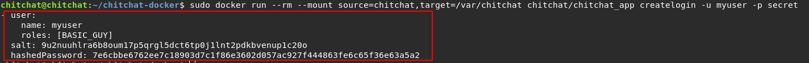

# Create a new user

To create a new user for your chitchat application, first stop the docker-compose process

```shell
docker-compose down
```

Next, **change the `USER` and `PASSWORD`** arguments in the line below and copy-paste & execute the line in a terminal

```shell
sudo docker run --rm --mount source=chitchat,target=/var/chitchat chitchat/chitchat_app createlogin -u USER -p PASSWORD
```

This will return a user entry in the terminal like in the image below. You can optionally also add additional roles (e.g. ADMIN) for your new user.



Copy-paste the entry into the `settings.yml` file (under the `auth` section)


Finally, run the following to copy your new settings to the docker volume:

```bash
bash update_settings.sh
```

Note that you should put your password in a password manager *because it will not be retrievable if you forget it*.
