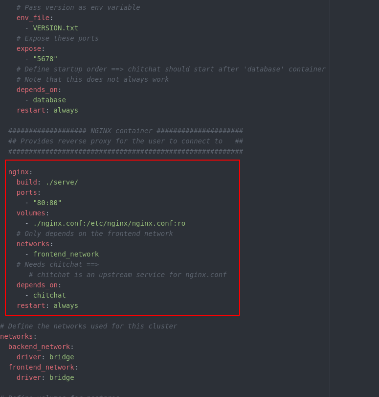
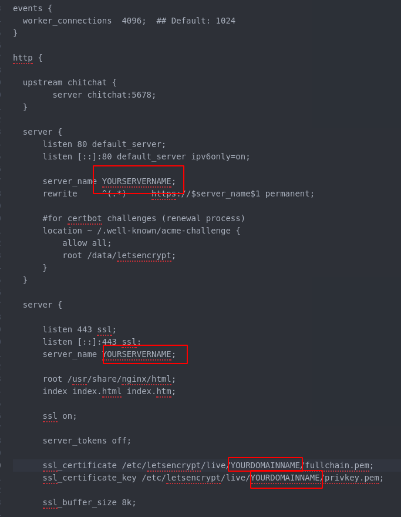

# Setting up SSL

**NOTE:** This tutorial assumes that

1. You have already set up a chitchat environment on your server (possibly using [this](https://github.com/JasperHG90/chitchat-docker/blob/master/docs/configuring_and_hosting.md) tutorial)
2. You own a domain name and have pointed it at your server.

While you could run the server as is with the non-ssl configuration, this is not advisable. The traffic going in and out our server is not encrypted and traffic can be intercepted by some third party. The following steps are based on [this](https://www.humankode.com/ssl/how-to-set-up-free-ssl-certificates-from-lets-encrypt-using-docker-and-nginx) tutorial.

## Configuring SSL

1. Boot into your server and execute the following command to create a letsencrypt folder

```bash
sudo mkdir -p /docker/letsencrypt-docker-nginx/src/letsencrypt/letsencrypt-site
```

2. Create a new `docker-compose.yml` file by executing

```shell
sudo nano /docker/letsencrypt-docker-nginx/src/letsencrypt/docker-compose.yml
```

Then, copy-paste the following:

```yml
version: '3.1'

services:

  letsencrypt-nginx-container:
    container_name: 'letsencrypt-nginx-container'
    image: nginx:latest
    ports:
      - "80:80"
    volumes:
      - ./nginx.conf:/etc/nginx/conf.d/default.conf
      - ./letsencrypt-site:/usr/share/nginx/html
    networks:
      - docker-network

networks:
  docker-network:
    driver: bridge
```

Save the file by hitting `CONTROL` + `X` and then `Y` + `<ENTER>`.

3. Create an `nginx.conf` file by executing

```bash
sudo nano /docker/letsencrypt-docker-nginx/src/letsencrypt/nginx.conf
```

In the line below, change `YOURSERVERNAME` to your domain name (e.g. `chitchat.nl`). Then paste it into the terminal

```conf
server {
    listen 80;
    listen [::]:80;
    server_name YOURSERVERNAME;

    location ~ /.well-known/acme-challenge {
        allow all;
        root /usr/share/nginx/html;
    }

    root /usr/share/nginx/html;
    index index.html;
}
```

Save the file (use the same commands as above) and execute the following to start the server:

```bash
cd /docker/letsencrypt-docker-nginx/src/letsencrypt
sudo docker-compose up -d
```

4. Copy the command below into a temporary file (e.g. a text file). Change YOUREMAILADDRES@YOURHOST.EXTENSION to your email address (e.g. johnnyappleseed@gmail.com). Then, change `www.MYWEBSITE.EXTENSION MYWEBSITE.EXTENSION` to your website domain (e.g. www.chitchat.org chitchat.org).

```bash
sudo docker run -it --rm \
-v /docker-volumes/etc/letsencrypt:/etc/letsencrypt \
-v /docker-volumes/var/lib/letsencrypt:/var/lib/letsencrypt \
-v /docker/letsencrypt-docker-nginx/src/letsencrypt/letsencrypt-site:/data/letsencrypt \
-v "/docker-volumes/var/log/letsencrypt:/var/log/letsencrypt" \
certbot/certbot \
certonly --webroot \
--email YOUREMAILADDRES@YOURHOST.EXTENSION --agree-tos --no-eff-email \
--webroot-path=/data/letsencrypt \
-d www.MYWEBSITE.EXTENSION MYWEBSITE.EXTENSION
```

5. Copy the adjusted command in the text file and paste it into the terminal.

6. Terminate the server by executing `sudo docker-compose down`.

7. Next, we set up some additional folders and generate a strong Diffie–Hellman group for extra security:

```bash
sudo mkdir -p /docker/letsencrypt-docker-nginx/src/production/dh-param
sudo openssl dhparam -out /docker/letsencrypt-docker-nginx/src/production/dh-param/dhparam.pem 2048
```

8. Open up the `docker-compose.yml` file in the `chitchat-docker` directory by executing `nano docker-compose.yml`. It should look like this:



Now, replace the `nginx` block (surrounded by red rectangle in the image above) with the following. **NOTE: Make sure that you replace <YOURDOMAINNAME> with the domain name you used in step 4**:

```yml
nginx:
  build: ./serve/
  ports:
    - "80:80"
    - "443:443"
  volumes:
    - ./nginx-ssl.conf:/etc/nginx/nginx.conf:ro
    - /docker/letsencrypt-docker-nginx/src/production/dh-param/dhparam.pem:/etc/ssl/certs/dhparam-2048.pem
    - /docker-volumes/etc/letsencrypt/live/<YOURDOMAINNAME>/fullchain.pem:/etc/letsencrypt/live/<YOURDOMAINNAME>/fullchain.pem
    - /docker-volumes/etc/letsencrypt/live/<YOURDOMAINNAME>/privkey.pem:/etc/letsencrypt/live/<YOURDOMAINNAME>/privkey.pem
  # Only depends on the frontend network
  networks:
    - frontend_network
  # Needs chitchat ==>
     # chitchat is an upstream service for nginx.conf
  depends_on:
    - chitchat
  restart: always
```

9. On your server, open up the `nginx-ssl.conf` document and replace any instance of `YOURSERVERNAME` and `YOURDOMAINNAME` with the same values you used in step 8.

```shell
nano nginx-ssl.conf
```



Next, hit `CONTROL + X`, `Y` and `<ENTER>` to save the changes.

10. Finally, we need to ensure that the SSL certificate is updated frequently so it doesn't expire. Execute `sudo crontab -e` and add the following lines:

```bash
0 0 1 * * docker run --rm -it --name certbot -v "/docker-volumes/etc/letsencrypt:/etc/letsencrypt" -v "/docker-volumes/var/lib/letsencrypt:/var/lib/letsencrypt" -v "/docker-volumes/data/letsencrypt:/data/letsencrypt" -v "/docker-volumes/var/log/letsencrypt:/var/log/letsencrypt" certbot/certbot renew --webroot -w /data/letsencrypt --quiet && docker kill --signal=HUP chitchat-docker_nginx_1
```

Hit `CONTROL + X`, `Y` and `<ENTER>`. The letsencrypt certificate will now be renewed every month.

11. Now execute `docker-compose up -d`. The server should now configure itself in the background and will be accessible at https://YOURDOMAIN.EXTENSION
